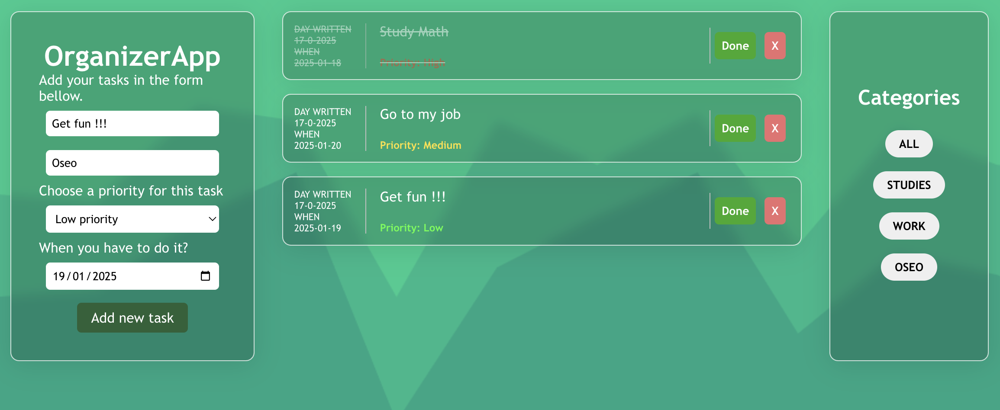

# To-Do App 📝✅  

A feature-rich To-Do application built with React to help you organize tasks effectively. With options to categorize, prioritize, and track deadlines, this app is your ultimate productivity tool!  

## Features ✨  
- **Add, Edit, and Delete Tasks**: Manage your tasks effortlessly.  
- **Mark Tasks as Completed**: Keep track of what’s done and what’s pending.  
- **Categorize Tasks**: Organize tasks into different categories (e.g., Work, Personal, Shopping).  
- **Set Deadlines**: Add due dates to stay on top of your schedule.  
- **Prioritize Tasks**: Assign low, medium, or high priority to each task.  
- **Filter**: View tasks by category.  

## How It Works ⚙️  
1. Add a new task with a title, category, priority, and deadline.  
2. View tasks in a categorized list.  
3. Mark tasks as done or delete them when no longer needed.  
4. Filter tasks based on category.  

## Tech Stack 🛠️  
- **Frontend**: React, CSS Modules for styling.  
- **State Management**: React Hooks (useState, useEffect).  

## Demo 🚀  

